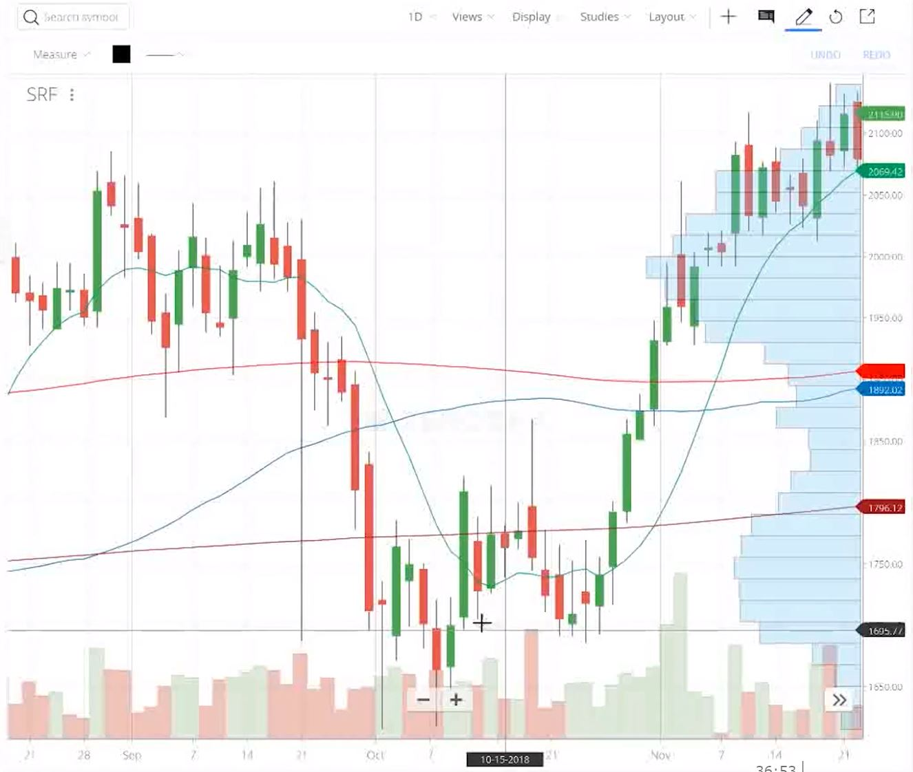

# Algo Trading

This is a sample project created while teaching a LearnApp course - [Learn How Algo Trading Works](https://learnapp.co/courses/Learn-How-Algo-Trading-Works/trailer)

**NOTE:**

> We do not recommend or want anyone to use this as a live system. It is for demonstration and educational purposes only. Use it to further your research only.

### 📈 [Learn How Algo Trading Works](https://learnapp.co/courses/Learn-How-Algo-Trading-Works/trailer)

 

In this course we have discussed the followings:

- What is a **trading system**
- What is algorithmic trading and how it differs from normal manual trading
- How to connect and use a Stock Broker's API. Here we have taken the example of **[Kite API](https://kite.trade)** from Zerodha
- We describe a highly profitable strategy which is a variant of **momentum strategy**
- We also describe and **backtest** the strategy to put our algorithm to the test of time

## 🙈 Prerequisite

- You will need **[NodeJS](https://nodejs.org/en/)** version 9 or above
- Good understanding of ES6 ... [Learn ES6 Here](http://exploringjs.com/es6/)
- Access to a stock broker's APIs
- Update the `api_key` and `api_secret` in `src/config.js`

```js
module.exports = {
  kiteConfig: {
    api_key: '<YOUR API KEY>',
    api_secret: '<YOUR API SECRET>',
  }
}
```

## 🚀 Installation

Install the project dependencies as follows

```bash
npm install
```

To start the server use

```bash
npm start
```

This will start the server at [http://localhost:8080](http://localhost:8080)

## 🔗 API

##### Status

Check the [API status](http://localhost:8080/)

```http request
GET /
```

##### Login

[Login to Kite](http://localhost:8080/login)

```http request
GET /login
```

##### Login Callback

On successful login, Kite will redirect to the login callback with a request_token query parameter.

```http request
GET /login/callback?success=true&request_token=xxxx
```

##### Backtest

Start the [Backtest](http://localhost:8080/backtest)

```http request
GET /backtest?year=2018&shouldDownload=yes
```

There are two optional query parameters for this request - 

- `year` The year for which to run the backtest (defaults to 2018)
- `shouldDownload` Whether or not to download the OHLC data for all NFO stocks before running the backtest (defaults to false). If any value is present in this parameter, then it will be treated as `true` value

**NOTE:** 
_It is important that you login before running the backtest for the first time. Also, you must login before running the backtest if you wish to download the yearly ohlc data._

## 💻 Development

The project has ESLint support to help you maintain best coding practices and can be run as follows

```bash
npm run lint
```

#### SSL

You can optionally configure the server to run on https:// but you will need to generate SSL certificates for that. You can generate a self signed certificate for localhost as follows:

```bash
openssl genrsa -out localhost.key 2048
openssl req -new -x509 -key localhost.key -out localhost.cert -days 3650 -subj /CN=localhost
```

There is a helper script already in this which you can use `./generate-ssl-certs.sh`

If you wish to use SSL, you will need to modify the code as follows:

```javascript
const fs = require('fs');
const https = require('https');

const express = require('express');

const app = express();

const server = https.createServer({
  key: fs.readFileSync('./certs/localhost.key'),
  cert: fs.readFileSync('./certs/localhost.cert'),
  requestCerts: false,
  rejectUnauthorized: false,
}, app);

// ...
// --- api routes related code 
// ...

server.listen(8080, () => console.log('Server is listening on port 8080'));
```
